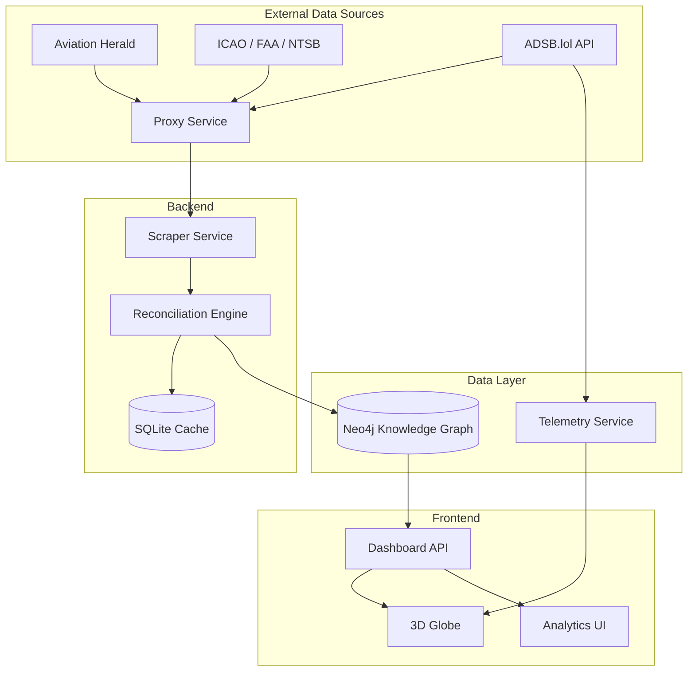

# Nyx: Flight Intelligence Engine

Nyx is a platform designed for real-time global aviation incident monitoring and safety analysis. By combining data from multiple authoritative sources into a relational knowledge graph, Nyx provides a consistent reference point for aviation safety analysis.

## Project Goals

The primary objective of Nyx is to provide a transparent and high-performance system for tracking aviation occurrences worldwide.

*   Real-time Monitoring: Automatically ingest data from sources like The Aviation Herald and official government bodies.
*   Pattern Analysis: Identify trends in fleet safety and regional risks.
*   Data Integrity: Implement a Source Authority Ranking (SAR) to resolve conflicting information between news and official reports.
*   Performance: Ensure low-latency queries across large datasets.

## Technical Stack

Nyx is built using a scalable stack chosen for performance and reliability:

*   Frontend: React, Vite, and CSS for the user interface.
*   Visualisation: Three.js for the 3D globe.
*   Primary Database: Neo4j (Graph) for mapping relationships between aircraft, airlines, airports, and incidents.
*   Secondary Database: SQLite for local caching and audit logging.
*   Backend: Node.js and TypeScript for the data pipeline.

## System Architecture

Nyx uses a decoupled architecture where the ingestion engine processes data from external sources and feeds the graph database. The system integrates live ADSB telemetry for real-time tracking.



### Key Features
*   Movement Interpolation: Decouples 3D motion from API polling latency using a continuous physics model.
*   Batched Telemetry Loading: Efficient processing (150 units per frame) that populates large aircraft fleets without blocking the main browser thread.
*   Atmospheric Overlays: Integrated gradient fades to ensure HUD data remains readable against the globe background.
*   Memory Management: Optimized Three.js loop utilizing scratchpad memory to handle thousands of concurrent contacts with minimal overhead.

## Data Model: Situational Awareness

The frontend consumes a telemetry stream, transforming raw JSON packets into a standard FlightState model.

### Telemetry Interface (FlightState)
| Property | Type | Description |
| :--- | :--- | :--- |
| hex | string | Unique 24-bit ICAO mode-S identifier. |
| flight | string | Callsign (e.g. BAW123). |
| lat / lon | number | WGS84 decimal coordinates. |
| alt_geom | number | Geometric altitude (GPS-based). |
| track | number | Magnetic heading (0-359°). |
| gs | number | Ground speed in knots. |
| squawk | string | 4-digit transponder code (7700 = Emergency). |

## Data Cleansing and Normalisation

Nyx employs a parsing pipeline to transform unstructured text from The Aviation Herald (AVHerald) into a structured data model.

### 1. Headline Parsing
Raw headlines are processed to extract core entities:
*   Pattern Matching: Uses ICAO-compliant strings to identify aircraft types.
*   Entity Mapping: Segments the string into Airline, Aircraft, Location, and Date.
*   Normalization: Standardises airline names and removes noise characters to ensure database consistency.

### 2. Information Extraction
The content of an article is separated into three fields:
*   Narrative: The primary chronological account of the incident.
*   METAR Data: Extraction of meteorological data for environmental analysis.
*   Timestamps: Capture of report and update times to track incident development.

### 3. Model Fitting
Data is validated against the schema before being committed to the database:
*   Unique ID: Every incident is indexed by its original Article ID to prevent duplicates.
*   Type Conversion: Numeric values are sanitised and cast to appropriate formats for processing.
*   Relationship Linking: The reconciliation engine ensures incidents are linked to existing aircraft, airline, and airport records.

## Core Logic and Telemetry Handling

### 1. Motion Smoothing
Nyx uses a continuous interpolation model to eliminate snapping. Instead of moving a plane instantly to new coordinates, the system calculates a 60-second projection:
*   Projection: Target Position = Current Position + (Ground Speed * 60s).
*   Interpolation: The plane moves towards this target at a rate of 1.5% per frame.
*   Benefit: This ensures fluid motion even if an API update is delayed.

### 2. Altitude Handling
Altitude is treated as a radial offset from the globe centre:
*   Radius: Globe Radius + (Altitude * Scale).
*   Smoothing: A 5% vertical lerp is applied to altitude changes to prevent sudden jumps.

### 3. Contact Persistence
Data can be intermittent due to signal issues or proxy shifts:
*   Grace Period: Aircraft are only removed after 3 consecutive failed updates (90 seconds).
*   Stale Tracking: Contacts remain at their last known projected vector until the grace period expires or new data is received.

### 4. Mathematical Optimisation
To handle large fleets (5,000+ aircraft) without browser freezing:
*   Scratchpad Vectors: 3D calculations use a pre-allocated pool of objects to avoid constant memory allocation.
*   Early Exit Culling: Visibility is calculated before expensive matrix math, allowing the engine to skip processing for approximately 50% of the fleet in every frame.

## Governance and Safety

Nyx implements a Source Authority Ranking (SAR) system to ensure data reliability.

| Authority Level | Source Type | Description |
| :--- | :--- | :--- |
| Level 1 (Highest) | ICAO / NTSB Final Reports | Conclusive, legally binding data. |
| Level 2 | FAA / EASA Preliminary | Official government data, subject to update. |
| Level 3 | The Aviation Herald | Verified news-based reports. |

When data conflicts occur, the system promotes the highest-ranking source's data to the primary field while preserving other reports in an audit trail.

## Local Setup

### Prerequisites
*   Node.js (v20+)
*   WSL2 (if on Windows) or Docker
*   Neo4j (v5+)

### Setup Instructions

1.  Clone the repository:
    ```bash
    git clone https://github.com/vanillabrand/Nyx.git
    cd Nyx
    ```

2.  Install dependencies:
    ```bash
    npm install
    ```

3.  Configure Environment:
    Create a `.env` file in the root directory:
    ```env
    NEO4J_URI=bolt://localhost:7687
    NEO4J_USER=neo4j
    NEO4J_PASSWORD=your_password
    ```

4.  Initialise the Database:
    ```bash
    npm run db:bootstrap
    ```

5.  Run the Application:
    ```bash
    npm run dev
    ```

## External Data Sources
*   The Aviation Herald: Incident alerts.
*   ADSB.lol: Live aircraft telemetry.
*   ICAO Doc 8643: Aircraft type designators.
*   NTSB/FAA Databases: Regulatory incident data.
