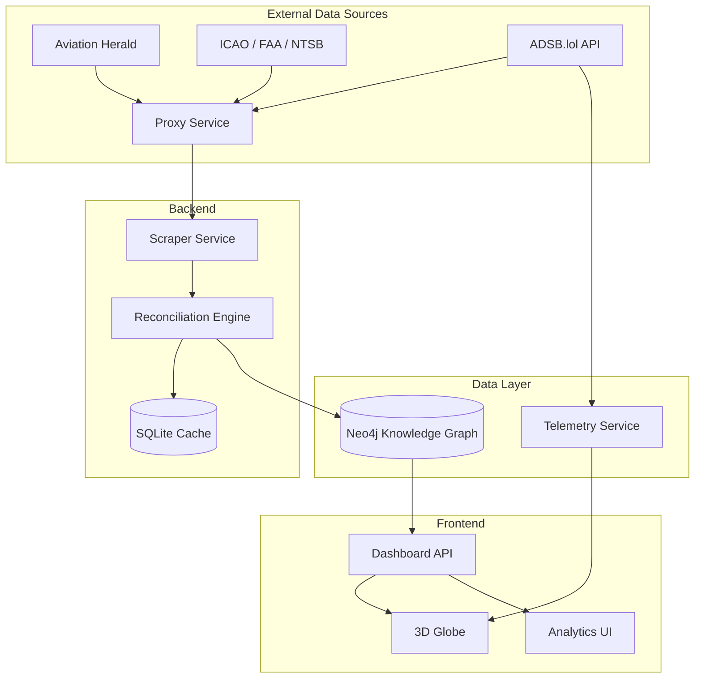

# Nyx: Flight Intelligence Engine

Nyx is a platform designed for real-time global aviation incident monitoring and safety analysis. By combining data from multiple authoritative sources into a relational knowledge graph, Nyx provides a consistent reference point for aviation safety analysis.

## Project Goals

The primary objective of Nyx is to provide a transparent and high-performance system for tracking aviation occurrences worldwide.

*   Real-time Monitoring: Automatically ingest data from sources like The Aviation Herald and official government bodies.
*   Pattern Analysis: Identify trends in fleet safety and regional risks.
*   Data Integrity: Implement a Source Authority Ranking (SAR) to resolve conflicting information between news and official reports.
*   Performance: Ensure low-latency queries across large datasets.

## Technical Stack

Nyx is built using a scalable stack chosen for performance and reliability:

*   Frontend: React, Vite, and CSS for the user interface.
*   Visualisation: Three.js for the 3D globe.
*   Primary Database: Neo4j (Graph) for mapping relationships between aircraft, airlines, airports, and incidents.
*   Secondary Database: SQLite for local caching and audit logging.
*   Backend: Node.js and TypeScript for the data pipeline.

## System Architecture

Nyx uses a decoupled architecture where the ingestion engine processes data from external sources and feeds the graph database. The system integrates live ADSB telemetry for real-time tracking.



### Key Tactical Features
*   Movement Interpolation: Decouples 3D motion from API polling latency using a continuous physics model.
*   Sticky Quota Management: Handles airspaces with more than 5,000 active aircraft by prioritising existing contacts. This prevents the mass deletion and recreation of meshes, ensuring rendering stability.
*   Critical Priority Ingestion: Emergency aircraft (Squawk 7500, 7600, 7700) and user-tracked units bypass performance culling, ensuring 100% situational awareness for high-risk contacts.
*   Atmospheric Overlays: Integrated gradient fades to ensure HUD data remains readable against the globe background.

## Data Model and Telemetry Handling

The frontend consumes a telemetry stream, transforming raw JSON packets into a standard FlightState model.

### Telemetry Interface (FlightState)
| Property | Type | Description |
| :--- | :--- | :--- |
| hex | string | Unique 24-bit ICAO mode-S identifier. |
| flight | string | Callsign (e.g. BAW123). |
| lat / lon | number | WGS84 decimal coordinates. |
| alt_geom | number | Geometric altitude (GPS-based). |
| track | number | Magnetic heading (0-359°). |
| gs | number | Ground speed in knots. |
| squawk | string | 4-digit transponder code (7700 = Emergency). |

### 1. Motion Smoothing
Nyx uses a continuous interpolation model to eliminate snapping. Instead of moving a plane instantly to new coordinates, the system calculates a 60-second projection:
*   Projection: Target Position = Current Position + (Ground Speed * 60s).
*   Interpolation: The plane moves towards this target at a rate of 1.5% per frame.
*   Benefit: This ensures fluid motion even if an API update is delayed.

### 2. Altitude Handling
Altitude is treated as a radial offset from the globe centre:
*   Radius: Globe Radius + (Altitude * Scale).
*   Smoothing: A 5% vertical lerp is applied to altitude changes to prevent sudden jumps.

### 3. Contact Persistence
Data can be intermittent due to signal issues or proxy shifts:
*   Grace Period: Aircraft are only removed after 3 consecutive failed updates.
*   Stale Tracking: Contacts remain at their last known projected vector until the grace period expires or new data is received.

## Data Normalisation and Cleansing

Nyx employs a strict parsing pipeline to transform unstructured text data, specifically from The Aviation Herald (AVHerald), into the system's internal data model.

### 1. Headline Deconstruction
Raw headlines are processed to extract core entities through a multi-stage parser:
*   Pattern Matching: Identifies aircraft types (e.g. A320, B738) and registration formats (e.g. G-XXXX).
*   Entity Resolution: Maps strings to specific airlines and airports using ICAO and IATA databases.
*   UK Grammar Compliance: All generated summaries and parsed descriptions are normalised to UK English spelling (e.g. 'standardised', 'normalisation') to maintain consistent documentation.

### 2. Information Extraction Logic
The content of an incident report is separated into three tactical fields:
*   Narrative: A cleaned, chronological account of the incident, stripped of HTML noise and irrelevant boilerplate text.
*   METAR Extraction: Meteorological data is extracted from the text and hydrated into the weather layer.
*   Timeline Mapping: Captures report times and update cycles to track the lifecycle of the incident.

### 3. Model Fitting and Validation
Data is validated against the schema before being committed to the knowledge graph:
*   Deduplication: Every incident is indexed by a unique source ID to prevent redundant nodes.
*   Type Sanitisation: Numeric values (altitude, speed, coordinates) are validated and cast to appropriate types.
*   Graph Linking: The reconciliation engine ensures that each new incident is linked to the correct aircraft, operator, and location nodes within the Neo4j environment.

## Performance and Optimisation

To maintain a consistent 60FPS situational awareness HUD with over 5,000 concurrent contacts:

### 1. Zero-Allocation Rendering
High-frequency loops (animation and user interaction) utilise a pre-allocated pool of scratchpad vectors. This prevents thousands of memory allocations per second, eliminating Garbage Collection pauses that cause UI freezing.

### 2. Early Exit Culling
Visibility is calculated before expensive matrix math. The engine skips processing for aircraft located on the far side of the horizon, allowing the system to focus resources on visible contacts.

### 3. Thread-Safe Batching
Telemetry updates are processed in micro-batches (50 units per frame). A semaphore-based lock prevents overlapping hydration cycles, ensuring the browser remains responsive during massive fleet updates.

## Governance and Safety

Nyx implements a Source Authority Ranking (SAR) system to ensure data reliability.

| Authority Level | Source Type | Description |
| :--- | :--- | :--- |
| Level 1 (Highest) | ICAO / NTSB Final Reports | Conclusive, legally binding data. |
| Level 2 | FAA / EASA Preliminary | Official government data, subject to update. |
| Level 3 | The Aviation Herald | Verified news-based reports. |

When data conflicts occur, the system promotes the highest-ranking source's data to the primary field while preserving other reports in an audit trail.

## Local Setup

### Prerequisites
*   Node.js (v20+)
*   Neo4j (v5+)

### Setup Instructions

1.  Clone the repository:
    ```bash
    git clone https://github.com/vanillabrand/Nyx.git
    cd Nyx
    ```

2.  Install dependencies:
    ```bash
    npm install
    ```

3.  Configure Environment:
    Create a `.env` file in the root directory:
    ```env
    NEO4J_URI=bolt://localhost:7687
    NEO4J_USER=neo4j
    NEO4J_PASSWORD=your_password
    ```

4.  Initialise the Database:
    ```bash
    npm run db:bootstrap
    ```

5.  Run the Application:
    ```bash
    npm run dev
    ```

## External Data Sources
*   The Aviation Herald: Incident alerts.
*   ADSB.lol: Live aircraft telemetry.
*   ICAO Doc 8643: Aircraft type designators.
*   NTSB/FAA Databases: Regulatory incident data.
