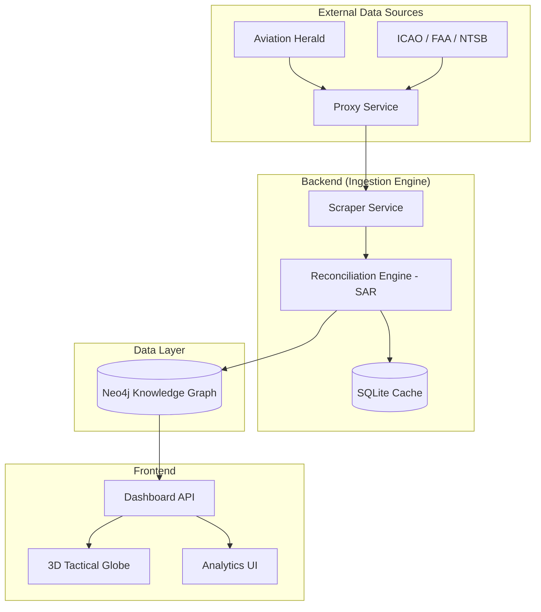

# Nyx: Flight Intelligence Engine (FIE)

Nyx is a high-fidelity, deterministic platform designed for real-time global aviation incident monitoring and predictive safety analysis. By unifying data from authoritative sources into a semantic knowledge graph, Nyx provides a "single source of truth" for aviation safety professionals.

---

## 🎯 Project Goals

The primary objective of Nyx is to provide a transparent, auditable, and high-performance system for tracking aviation occurrences worldwide. 

*   **Real-time Monitoring**: Automatically ingest data from sources like The Aviation Herald and official government bodies.
*   **Predictive Analytics**: Identify patterns in fleet safety and regional risks before they escalate.
*   **Data Integrity**: Implement a "Source Authority Ranking" (SAR) to resolve conflicting information between news and official reports.
*   **High Performance**: Ensure sub-2s query latency across hundreds of thousands of complex records.

---

## 🛠 The Tech Stack

Nyx is built using a modern, scalable stack chosen for performance and data integrity:

*   **Frontend**: React + Vite + Tailwind CSS for a responsive, premium user interface.
*   **Visualisation**: Three.js for a high-performance 3D tactical globe.
*   **Primary Database**: Neo4j (Graph) for mapping complex relationships between aircraft, airlines, airports, and incidents.
*   **Secondary Database**: SQLite for high-speed local caching and audit logging.
*   **Backend/Ingestion**: Node.js + TypeScript for a type-safe, resilient data pipeline.

---

## 🏗 System Architecture

Nyx uses a decoupled architecture where the ingestion engine acts as a "Truth Miner," feeding the graph database which then serves the frontend.



### Why this approach?
Unlike traditional relational databases, a **Graph Database** (Neo4j) allows us to query complex relationships—such as "Show me all incidents involving this specific aircraft engine type across different airlines"—in constant time.

---

## 📊 Data Schema & Standards

Nyx conforms to the **ICAO Annex 13 (ADREP)** and **ECCAIRS 2** international standards for aviation occurrence reporting.

### Core Entities (Mini-Specs)

*   **Incident**: The central event.
    *   *Example*: Engine failure at 30,000ft.
*   **Aircraft**: Specific hull by tail number.
    *   *Example*: G-VGIN (Boeing 787-9).
*   **Airline**: The operating carrier.
    *   *Example*: Virgin Atlantic.
*   **Airport**: The location of the event or origin/destination.
    *   *Example*: EGLL (London Heathrow).

---

## ⚖️ Governance & Safety

Nyx implements a **Source Authority Ranking (SAR)** system to ensure data reliability.

| Authority Level | Source Type | Description |
| :--- | :--- | :--- |
| **Level 1 (Highest)** | ICAO / NTSB Final Reports | Conclusive, legally binding data. |
| **Level 2** | FAA / EASA Preliminary | Official government data, subject to update. |
| **Level 3** | The Aviation Herald | Rapid, verified news-based reports. |

When data conflicts occur, Nyx automatically promotes the highest-ranking source's data to the "Truth" field while preserving other reports in the audit trail.

---

## 🚀 Local Setup & Configuration

### Prerequisites
*   Node.js (v20+)
*   WSL2 (if on Windows) or Docker
*   Neo4j (v5+)

### Setup Instructions

1.  **Clone the repository**:
    ```bash
    git clone https://github.com/vanillabrand/Nyx.git
    cd Nyx
    ```

2.  **Install dependencies**:
    ```bash
    npm install
    ```

3.  **Configure Environment**:
    Create a `.env` file in the root directory:
    ```env
    NEO4J_URI=bolt://localhost:7687
    NEO4J_USER=neo4j
    NEO4J_PASSWORD=your_password
    ```

4.  **Initialise the Database**:
    Run the bootstrap script to set up constraints and master data:
    ```bash
    npm run db:bootstrap
    ```

5.  **Run the App**:
    ```bash
    npm run dev
    ```

---

## 🌐 External Data Sources
*   **The Aviation Herald**: Primary source for real-time incident alerts.
*   **ICAO Doc 8643**: Master reference for aircraft type designators.
*   **NTSB/FAA Databases**: Historical and regulatory incident data.
```
